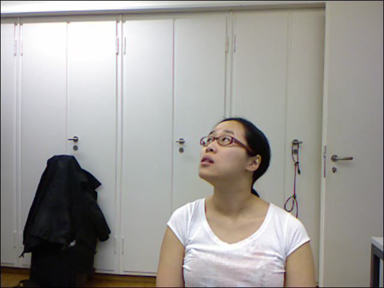
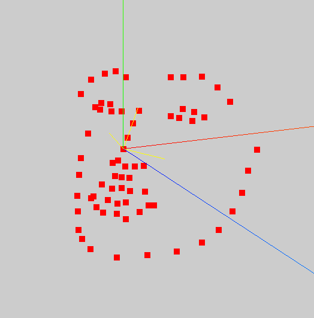

# HeadPoseEstimate
## Introduce
This is a head pose estimation system based on 3d facial landmarks. Please realize it's not the most advanced method in this field. Util I created this repository, there have been some end-to-end solutions.

## Usage
For image, run `python estimate_head_pose.py -i <path of image> --onnx`.  
For video, run `python estimate_head_pose_video.py -i <path of video> --onnx`.

## How does it work
### 1. Get the 3d facial landmarks
First, thanks for cleardusk's excellent work on [3DDFA_V2](https://github.com/cleardusk/3DDFA_V2). With TDDFA model, we can get 3d facial landmarks quickly and precisely.
### 2. Determine direction of face
The horizontal direction `hd` and vertical direction `vd` of face can be determined by PCA. Let's notate facial orientation with `fd`, then `fd = hd x vd`. Note: `x` is cross products.  
Here is an example. The origin image(from Biwi_Kinect_Head_Pose_Database):

The following image shows 68 landmarks.  
Red axis: X  
Green axis: Y  
Blue axis: Z  
The three yellow arrows are `hd`, `vd` and `fd`.

### 3. Estimate rotation
Normalize `hd`, `vd` and `fd`, make them as unit vectors.   
Rotation matrix can be estimated with Kabsch algorithm.

## TODO
- [ ] support video

## Citation

    @inproceedings{guo2020towards,
        title =        {Towards Fast, Accurate and Stable 3D Dense Face Alignment},
        author =       {Guo, Jianzhu and Zhu, Xiangyu and Yang, Yang and Yang, Fan and Lei, Zhen and Li, Stan Z},
        booktitle =    {Proceedings of the European Conference on Computer Vision (ECCV)},
        year =         {2020}
    }

    @misc{3ddfa_cleardusk,
        author =       {Guo, Jianzhu and Zhu, Xiangyu and Lei, Zhen},
        title =        {3DDFA},
        howpublished = {\url{https://github.com/cleardusk/3DDFA}},
        year =         {2018}
    }